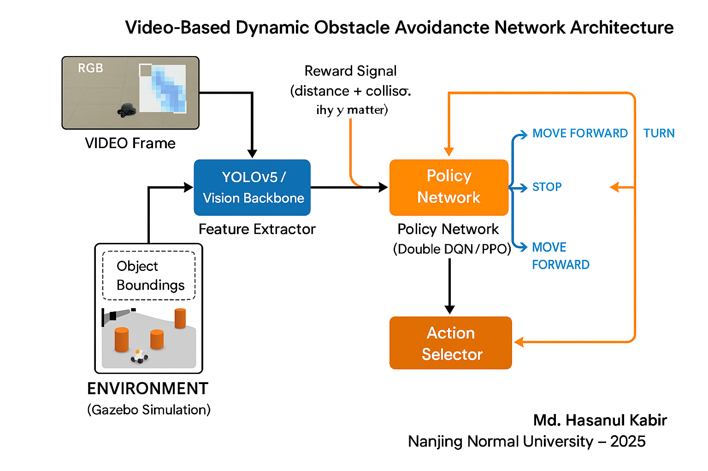

# Video-Based Dynamic Obstacle Avoidance Using Deep Reinforcement Learning

This repository contains the code, experiments, and results for my Master's research project on **video-based dynamic obstacle avoidance** using **Deep Reinforcement Learning (DRL)** at *Nanjing Normal University (Project 211)*.

## 🎯 Research Objective
To develop a real-time video-based obstacle avoidance system that allows mobile robots to navigate dynamic environments by integrating:
- **Computer Vision (YOLOv5)** for obstacle detection
- **Deep Reinforcement Learning (Double DQN, PPO)** for decision-making
- **Gazebo + ROS2 Simulation** for environment testing

## 🧠 Method Overview
- **Perception:** YOLOv5 extracts bounding boxes and depth cues from the robot’s camera feed.
- **State Representation:** The vision-based states are fused with positional data.
- **Action Policy:** A Double DQN agent selects motion commands (forward, rotate, stop) to maximize navigation rewards.
- **Reward Design:** Combines distance improvement, collision penalty, and smooth motion incentives.
- **Extension:** Initial experiments on **federated RL** and **adversarial robustness** for secure multi-robot navigation.

<p align="center">
  
</p>

## ⚙️ Dependencies
- Python 3.8+
- PyTorch 2.0+
- OpenAI Gym
- ROS2 Foxy
- Gazebo 11
- YOLOv5 (Ultralytics)
- NumPy, Matplotlib, Tensorboard

Install dependencies:
```bash
pip install -r requirements.txt
````

## 🚀 Training and Evaluation

Run training:

```bash
python src/main_train.py --config experiments/configs/yolo_double_dqn.yaml
```

Run evaluation:

```bash
python src/evaluate.py --weights results/best_model.pth
```

## 📊 Experimental Results

| Metric                 | Value      |
| :--------------------- | :--------- |
| Average Reward         | 264.7      |
| Success Rate           | 92.4%      |
| Average Episode Length | 1500 steps |

<p align="center">
  
</p>

## 📦 Repository Structure

```
src/         # Core source code
experiments/ # Configs, logs, and results
docs/        # Reports and figures
demo/        # Videos and screenshots
```

## 🧩 Future Work

This repository also forms the foundation of my proposed PhD work on:

* **Secure Reinforcement Learning**
* **Federated Optimization**
* **Trustworthy Multi-Agent Navigation**

## 👤 Author

**Md. Hasanul Kabir**
Master’s Student, Computer Science & Technology
Nanjing Normal University, China
📧 [hasanul.kabir09@gmail.com](mailto:hasanul.kabir09@gmail.com)
🌐 [Google Scholar / Website](https://sites.google.com/view/md-hasanul-kabir)
