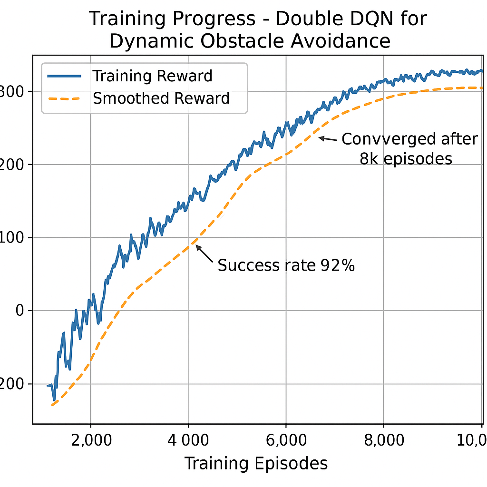

---

## 🧱 **Folder Structure**

```
dynamic_obstacle_avoidance/
│
├── README.md
├── requirements.txt
├── LICENSE               # optional (MIT if public)
│
├── src/
│   ├── agents/
│   │   ├── dqn_agent.py
│   │   ├── double_dqn_agent.py
│   │   ├── ppo_agent.py
│   │   └── utils.py
│   │
│   ├── environment/
│   │   ├── gazebo_env.py           # ROS2 interface for obstacle environment
│   │   ├── sensors.py              # camera, lidar data parser
│   │   └── reward_functions.py     # reward shaping for navigation
│   │
│   ├── perception/
│   │   ├── yolo_detector.py        # object detection with YOLOv5
│   │   ├── feature_extractor.py
│   │   └── tracker.py
│   │
│   ├── main_train.py               # training loop (Double DQN)
│   ├── evaluate.py                 # evaluation pipeline
│   ├── visualize.py                # render training results
│   └── federated_extension.py      # placeholder for future FedRL research
│
├── experiments/
│   ├── configs/
│   │   ├── base_config.yaml
│   │   ├── yolo_double_dqn.yaml
│   │   └── adversarial_test.yaml
│   │
│   ├── logs/
│   │   ├── run_2025_01/
│   │   │   ├── rewards_curve.png
│   │   │   ├── success_rate.csv
│   │   │   └── summary.txt
│   │
│   ├── results/
│   │   ├── obstacle_avoidance_accuracy.csv
│   │   └── performance_summary.pdf
│   │
│   └── notebooks/
│       ├── reward_analysis.ipynb
│       ├── model_visualization.ipynb
│       └── adversarial_test.ipynb
│
├── docs/
│   ├── method_description.pdf
│   ├── experiment_summary.md
│   └── network_architecture.png
│
└── demo/
    ├── demo_video.gif
    ├── robot_navigation.mp4
    └── screenshots/
        ├── environment_setup.png
        ├── training_reward_curve.png
        └── navigation_result.png
```

---

## 🧾 **Sample README.md (you can copy this)**

````markdown
# Video-Based Dynamic Obstacle Avoidance Using Deep Reinforcement Learning

This repository contains the code, experiments, and results for my Master's research project on **video-based dynamic obstacle avoidance** using **Deep Reinforcement Learning (DRL)** at *Nanjing Normal University (Project 211)*.

## 🎯 Research Objective
To develop a real-time video-based obstacle avoidance system that allows mobile robots to navigate dynamic environments by integrating:
- **Computer Vision (YOLOv5)** for obstacle detection
- **Deep Reinforcement Learning (Double DQN, PPO)** for decision-making
- **Gazebo + ROS2 Simulation** for environment testing

## 🧠 Method Overview
- **Perception:** YOLOv5 extracts bounding boxes and depth cues from the robot’s camera feed.
- **State Representation:** The vision-based states are fused with positional data.
- **Action Policy:** A Double DQN agent selects motion commands (forward, rotate, stop) to maximize navigation rewards.
- **Reward Design:** Combines distance improvement, collision penalty, and smooth motion incentives.
- **Extension:** Initial experiments on **federated RL** and **adversarial robustness** for secure multi-robot navigation.

<p align="center">
  
</p>

## ⚙️ Dependencies
- Python 3.8+
- PyTorch 2.0+
- OpenAI Gym
- ROS2 Foxy
- Gazebo 11
- YOLOv5 (Ultralytics)
- NumPy, Matplotlib, Tensorboard

Install dependencies:
```bash
pip install -r requirements.txt
````

## 🚀 Training and Evaluation

Run training:

```bash
python src/main_train.py --config experiments/configs/yolo_double_dqn.yaml
```

Run evaluation:

```bash
python src/evaluate.py --weights results/best_model.pth
```

## 📊 Experimental Results

| Metric                 | Value      |
| :--------------------- | :--------- |
| Average Reward         | 264.7      |
| Success Rate           | 92.4%      |
| Average Episode Length | 1500 steps |

<p align="center">
  
</p>

## 📦 Repository Structure

```
src/         # Core source code
experiments/ # Configs, logs, and results
docs/        # Reports and figures
demo/        # Videos and screenshots
```

## 🧩 Future Work

This repository also forms the foundation of my proposed PhD work on:

* **Secure Reinforcement Learning**
* **Federated Optimization**
* **Trustworthy Multi-Agent Navigation**

## 👤 Author

**Md. Hasanul Kabir**
Master’s Student, Computer Science & Technology
Nanjing Normal University, China
📧 [hasanul.kabir09@gmail.com](mailto:hasanul.kabir09@gmail.com)
🌐 [Google Scholar / Website](https://sites.google.com/view/md-hasanul-kabir)

```

---
